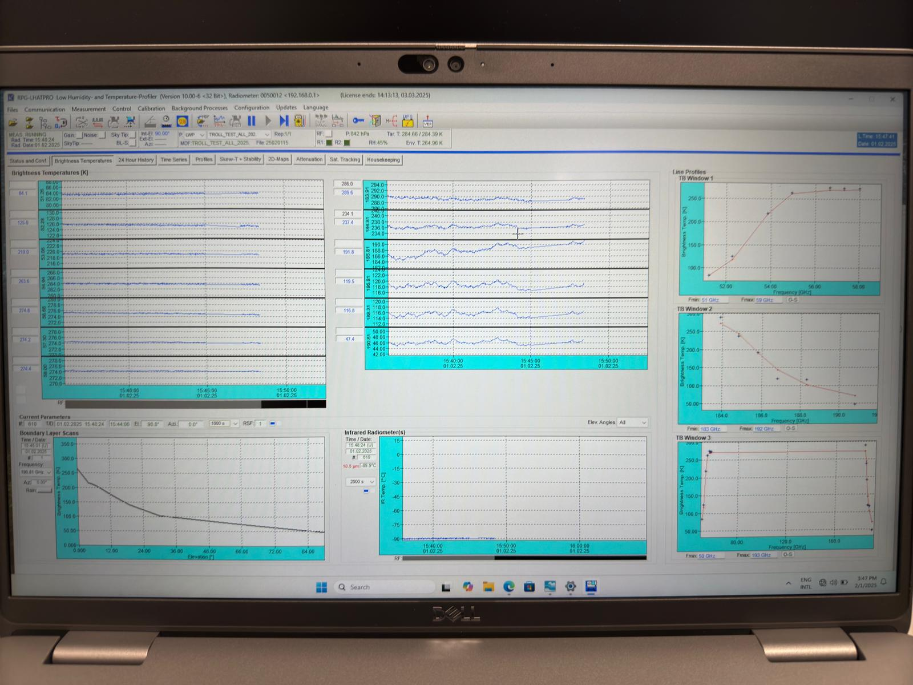
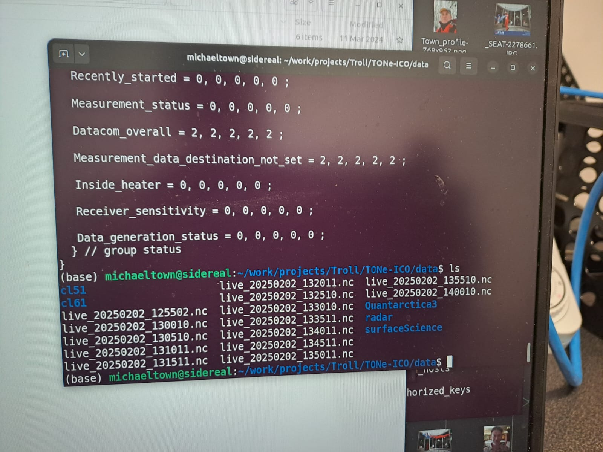

It's happening! Data is flowing! After only a couple weeks at Troll Station, our deployment crew has overseen: 

- the transport of all of our cargo from the ship to the station, 
- the construction of the ICO platform, 
- the installation of the three seatianers on the platform, 
- the placement of the roof rack on the ICO-Hub container, 
- the mounting of instruments on the roof rack, 
- setup of the ICO computer system,
- and now the flow of data!

Thanks to our deployment crew and all the help from various personnel at Troll Station that made this milestone possible. Science is hard work, so collaboration is essential. And it's clear that the folks at Troll have worked hard over the past few weeks to make this happen. Next up; DATA ANALYSIS!!

