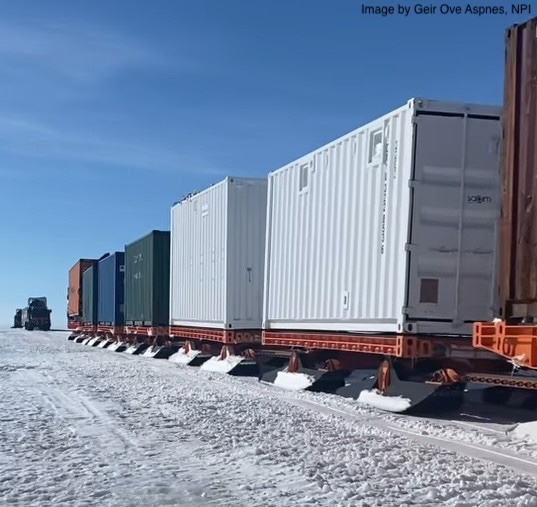

This might be a different type of train than you're used to. First of all, this train travels on skis, not tracks. Second, this train will travel across the Fimbul Ice Shelf and then onto the Antarctic continent at Troll Station. It will deliver some very important cargo for the ICO. Some of the containers shown in the image contain equipment for the ICO and will soon become buildings that house the ICO. Our field team is flying to Cape Town today and is super happy (and relieved) to see this train moving!!

