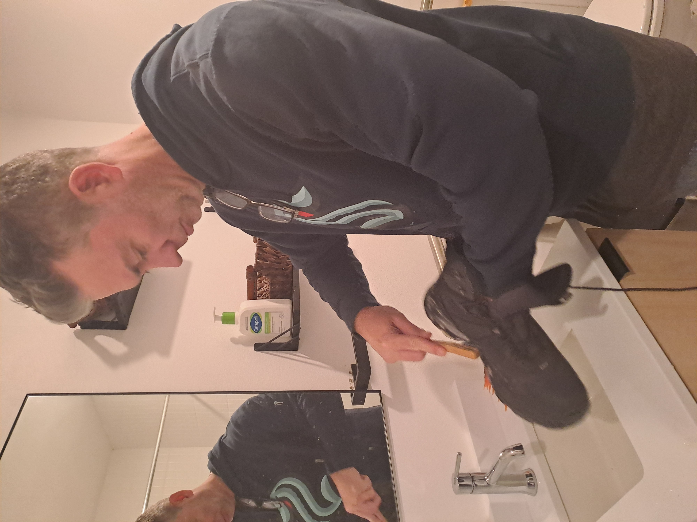

Antarctica is unlike any other place on Earth. It is a continent dedicated to science and cooperation, (relatively) free from territorial disputes or military conflicts— it remains a rare example of what humanity can achieve when we prioritize shared goals over competition. Governed by the Antarctic Treaty System, it is a symbol of what is possible when nations come together to protect a place for peaceful purposes and the pursuit of knowledge.

But protecting Antarctica requires effort at every level. It’s not just about the broad, robust international agreements; it’s about the small, everyday actions too. Every scientist, technician, and visitor to the icy expanse plays a role in keeping it pristine. This includes scrubbing boots free of mud and dirt to prevent the introduction of foreign diseases or pollen that could disrupt this fragile environment. 

The Integrated Cloud Observatory team's work focuses on placing atmospheric and surface observing instrumentation that will help understand the energy and mass fluxes into Antarctica. By improving our understanding of these processes, we hope to enhance predictions of sea level rise—a critical challenge in the face of climate change. One of the largest uncertainties in Antarctic ice sheet mass balance lies in the accumulation of the East Antarctic Ice Sheet. Its behavior is not just a question of regional importance but a factor that influences the entire global climate system.

Antarctica is special in its own right, a stark and beautiful wilderness that inspires awe and respect. But it’s also a vital piece of the planet’s climate puzzle. To lose it to carelessness or inaction would be a loss for the world. By protecting this extraordinary place—through treaties, through science, and even through scrubbing boots—we protect not just its uniqueness but its role as a cornerstone of Earth’s climate stability.

