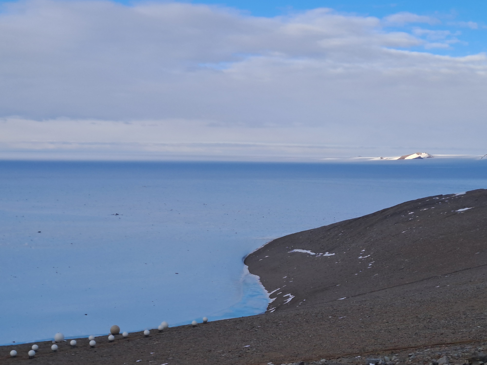
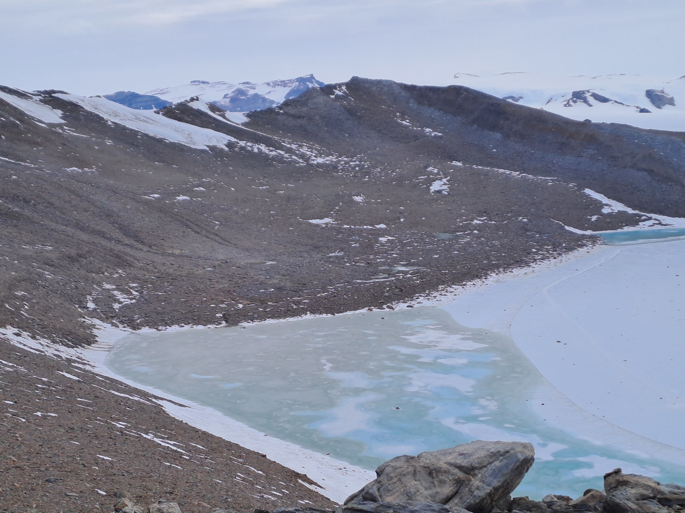
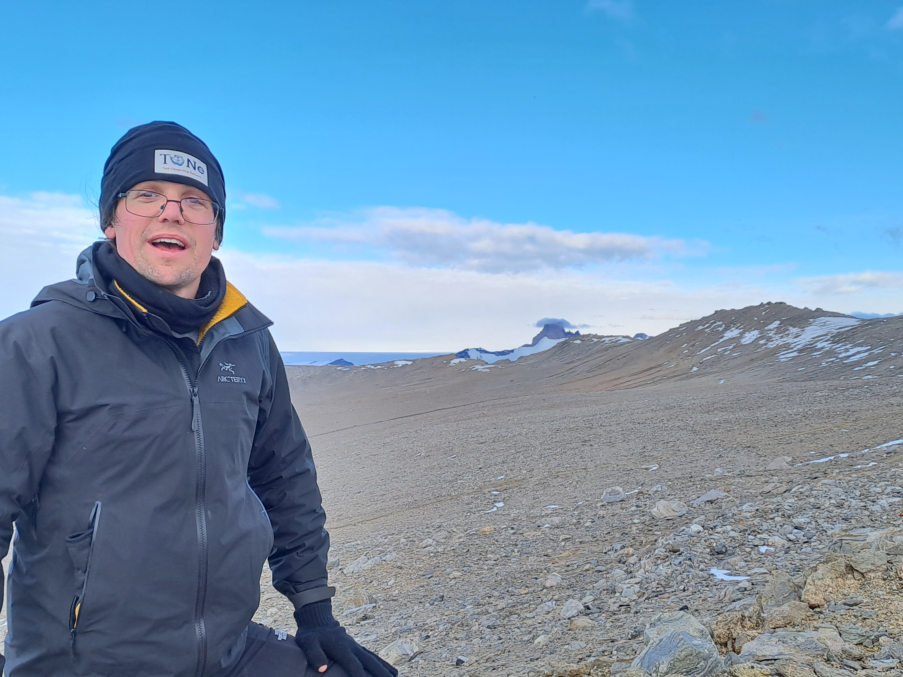
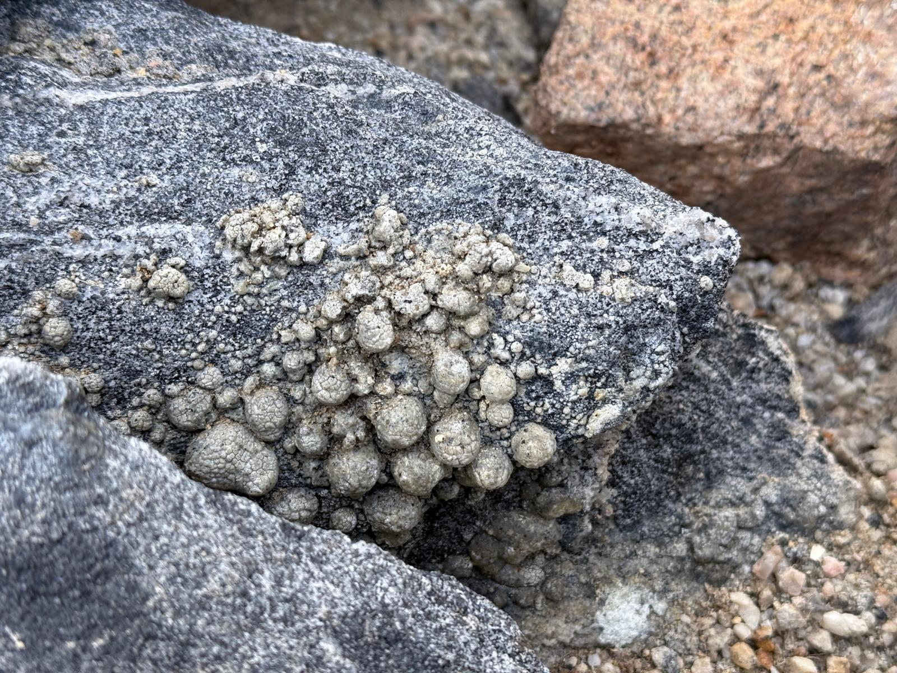

One of the many objectives of our work on the TONe-ICO project is to understand how mass and energy enter and leave Antarctica. It turns out that Antarctic mass balance is a critical component of predicting sea level rise. A warming climate will likely sequester more snow on the continent - a negative contribution. By the reckoning of some, the largest uncertainty in Antarctic mass balance in the 20th century happens to be accumulation in East Antarctica. 

Many aspects that govern these snowfall and accumulation in East Antarctica are poorly parameterized in regional and global models in no small part because this region is *complicated*. Here we have sea ice, ice shelf, an escarpment of nunataks and glacial outflow, snow, blue ice, dust. So many microclimates, each presenting their own scientific challenges to understand and model.

Troll station sits at one of these prototypical gateways. It's a perfect place to see how large scale synoptic atmospheric conditions interact with the variable and dynamic surfaces. We brought all the tools we could think of to probe these microclimates, and find that we need more.

This week, Neely and I had the opportunity to do some exploring the nunatak on which Troll sits. A few views from this exploration led to more questions than answers of how we will try to build a quantitative narrative of this place. Snow and dust come and go. Snow insulates, and reflects solar radiation. Dust and rock heat under the Sun, have high heat capacities, freeze and sequester melted water. There is more bare ice and melt here than ever before according to the 'locals'. 

Our exploration this week exposed the need for geologic expertise we are sorely lacking. We found formations that neither of us had ever imagined (see below). I did some basic 'science' on these features (poked them with my glove). They felt like rock. We brought pictures back to the station and discover that we weren't even puzzling over a rock formation, but petral vomit that could be thousands of years old. The avian experts on station said somewhere nearby there is a petral nest also probably thousands of years old - the vomit and doodie stratigraphy telling their own climatic history of the region.

(photo credit: Neely)

So many surprises waiting for us as we assimilate a picture from which we can base predictions of the future. It will definitely take a team to understand this place!

