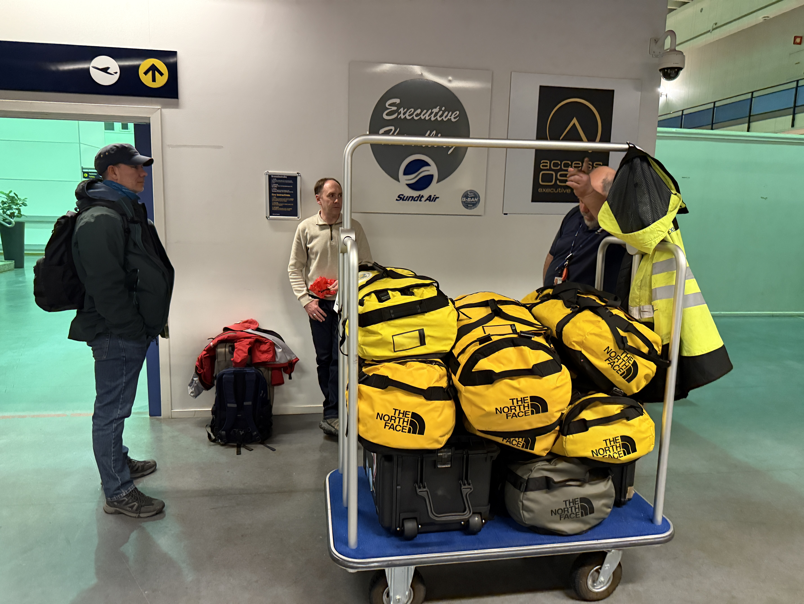
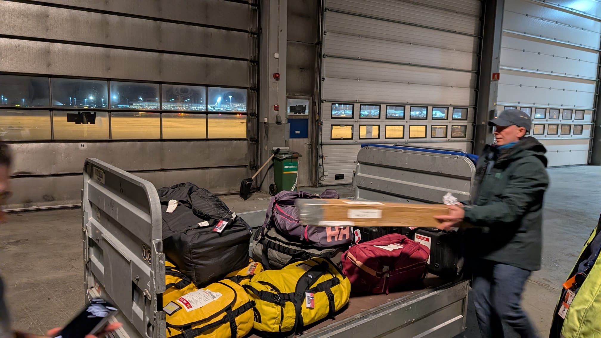

The TONe ICO team is "on the move". Marius Bratrein, Steve Hudson, Ryan Neely III, and Mike Town have started their journey south. WAY SOUTH to -72 S!!  The pictures below show them at the airport with their luggage. These bags contain extreme cold weather (ECW) clothing and a few scientific instruments, plus any last-minute items that will be needed. The team should arrive at Troll Station in a few days after flying from Oslo to Cape Town to Troll. That's a long trip... But it's good to finally be "on the move"!

::: {layout-ncol=2}

:::
