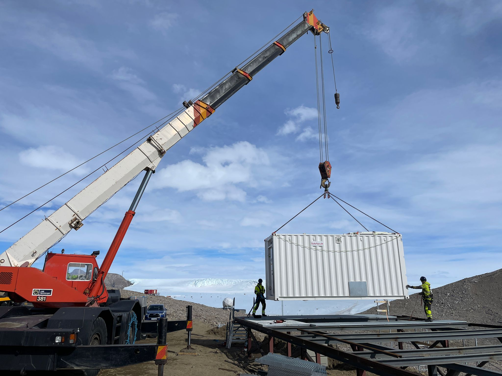
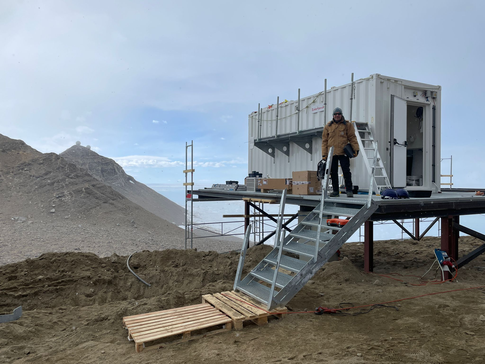
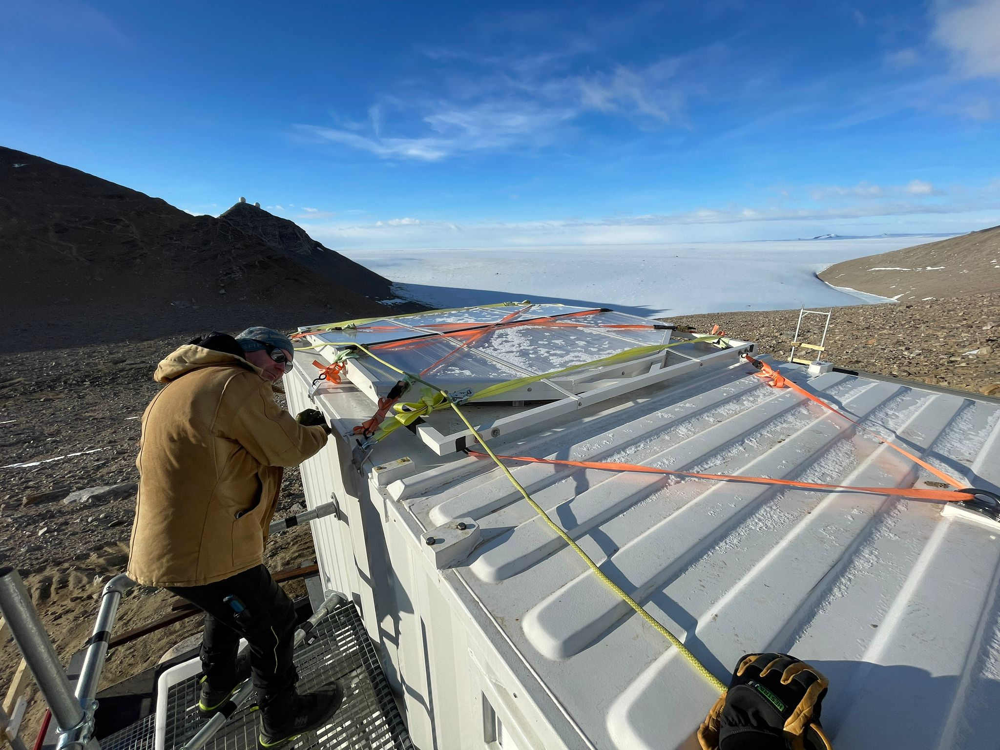

One big lift for TONe ICO, and one big lift for science at Troll! The first container was lifted onto the TONe ICO platform today. This container will house the automatic radiosonde launcher. Radiosonde are "weather balloons" that ICO will launch every day. Radiosondes (or just "sondes") provide valuable information about how the atmosphere is changing. The sondes will measure temperature, pressure, and humidity, as well as wind speed and direction, as they fly high up to 15-20 miles over the research station. These data will help us to understand the different atmospheric conditions that occur, like clear skies, storms, and windy periods. The next container to be lifted will house a gas generator that will create hydrogen to fill the weather balloons. Then the final container will house the different TONe instruments. More on that soon...

All photos by Marius Bratrein, Norwegian Polar Institute.
