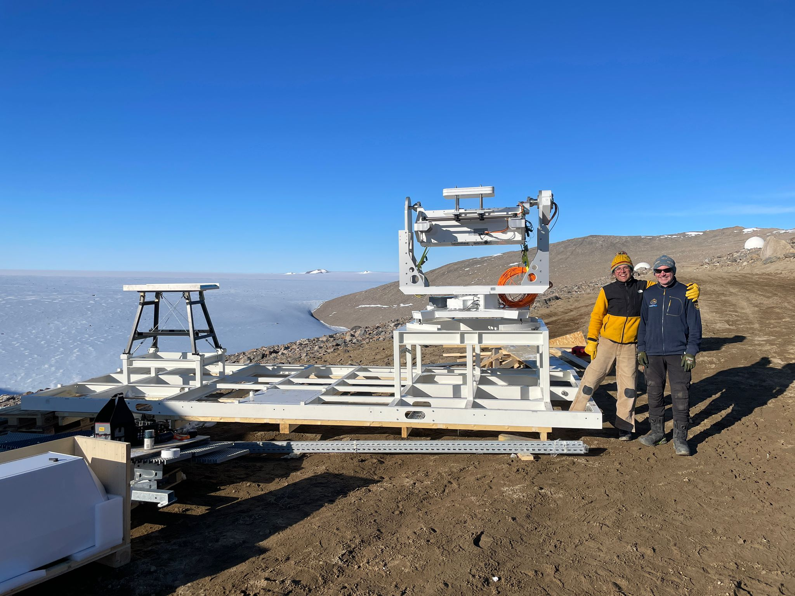

The instruments are starting to be assembled at Troll. Catch out the image below of the stand for the RPG Cloud Radar. This instrument will be a central piece of our scientific equipment at the ICO. This radar can scan and look at different places in the atmosphere over Troll Station and will tell us where clouds are and what their properties are. I can also see the Vaisala Cloud Lidar in the lower left, which I'm sure will be up and running soon. It's really exciting to see things literally "coming together"!

Photo by Marius Bratrein, Norwegian Polar Institute.
