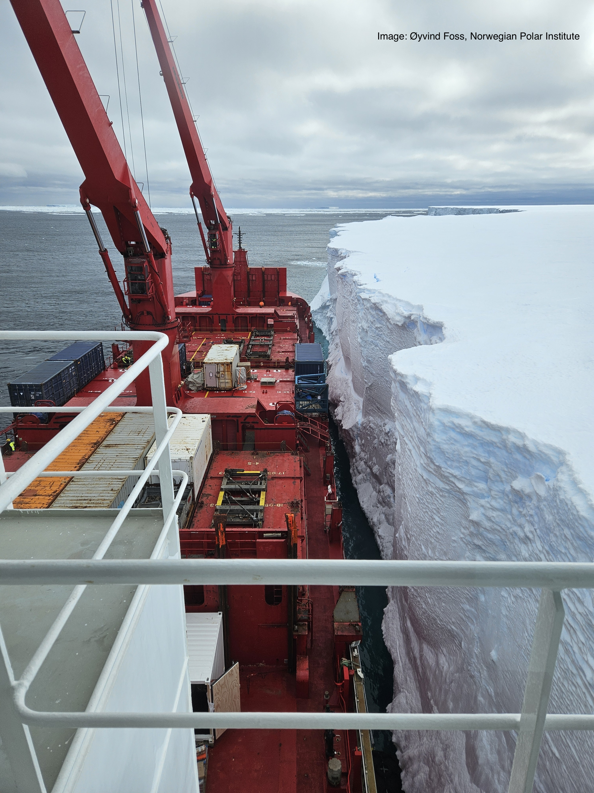

The cargo ship for Troll Station has docked to the Fimbul Ice Shelf. The cargo must now be offloaded onto the ice shelf using the enormous cranes on the ship. The cargo will then be transported (dragged) across the ice shelf and onto the Antarctic continent, then uphill to Troll Station. The cargo will include three "seatainers" that include all of the equipment that will be installed as part of the Integrated Cloud Observatory. Our installation team will start their journey south next week. We're hoping that the cargo will already be in Troll by the time they arrive. Bon voyage!!

