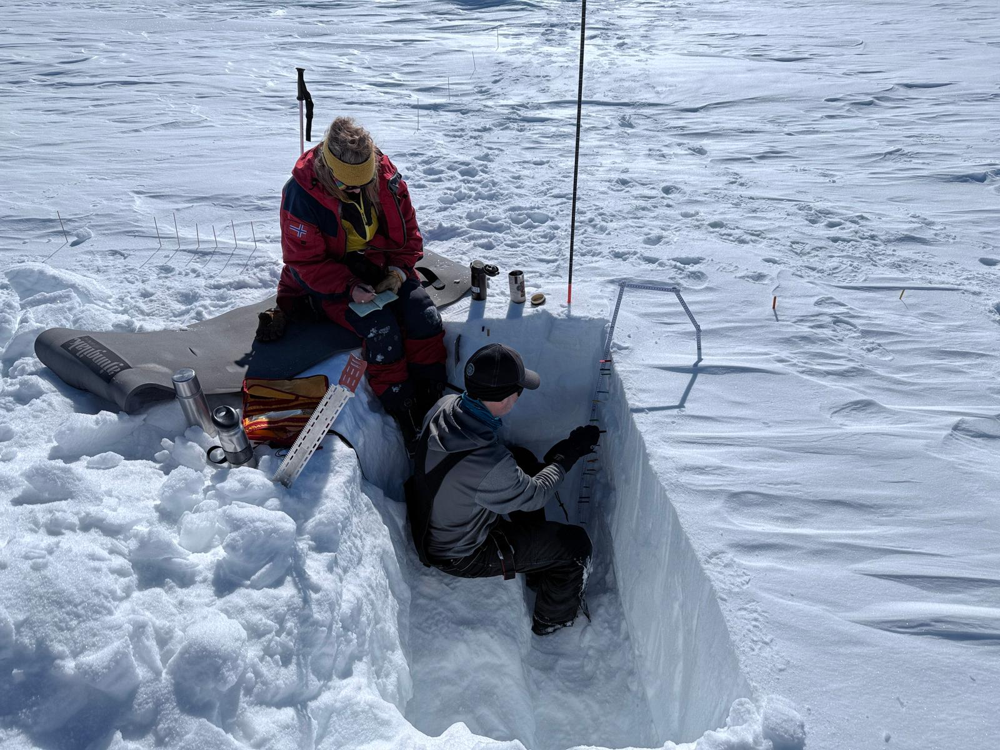
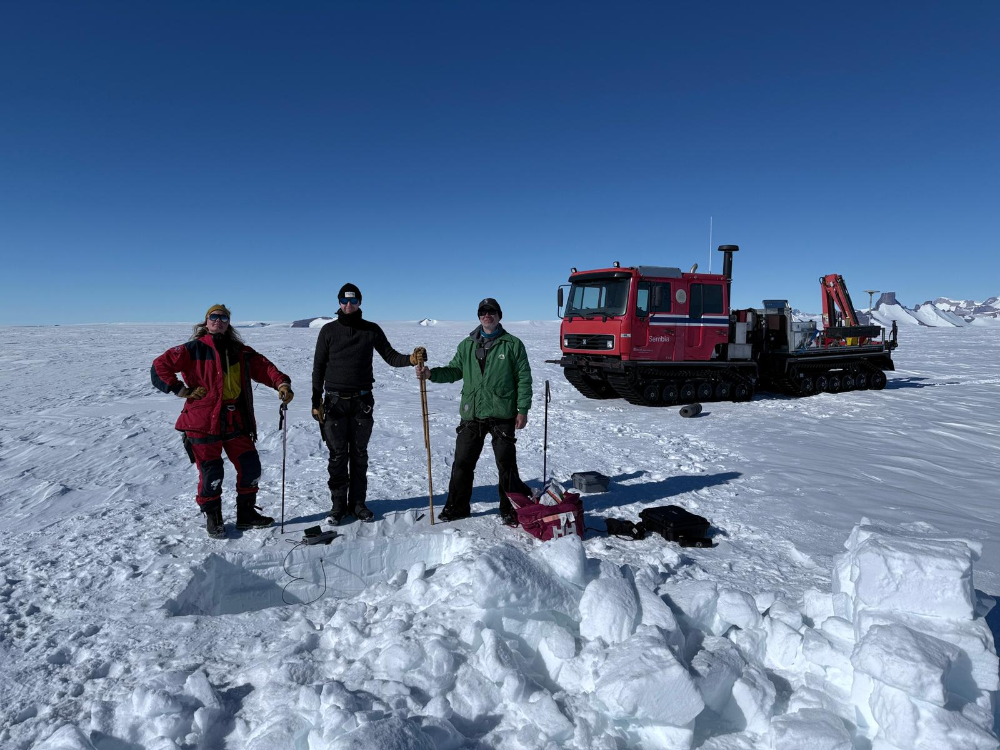

Schools occasionally have a "snow day", when school is cancelled because of a big snow storm. But our research team recently had a different type of "snow day". They went on a mini-expedition away from Troll Station to "play" in the snow. Specifically, they dug a pit to analyze the structure of the near-surface snow. Snow pit analysis is really important for the type of science that we're doing at Troll. The stratigraphy (layering) of the top 1 meter of snow can impact how heat and light are transmitted in and out of the snow. So, researchers dig a pit and then sit in it for a couple of hours making measurements of density, conductivity, liquid water content and more. Luckily, it was nice and sunny for this "snow day"!

