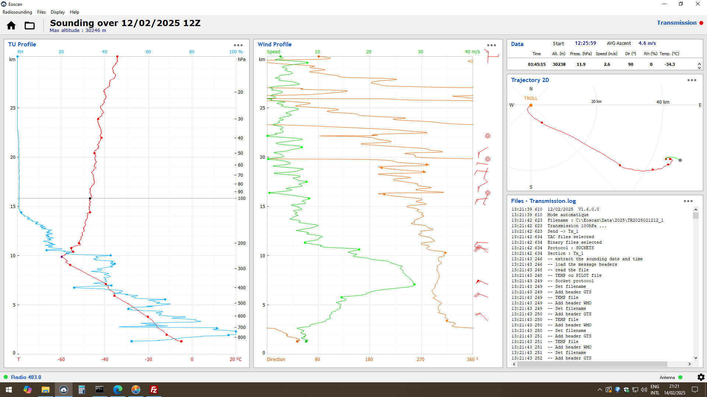

This is a follow-up blog post to [Up, Up and Away](../up-up-and-away/index.md) about our weather balloon launcher. The red line shows the temperature as a function of altitude. Note that the weather balloon reached a maximum altitude of about 30 km! That's high into the stratosphere! The minimum temperature was -60 C, which was reached at 10 km. This level of the atmosphere is called the "tropopause", which is the boundary between the troposphere (0 to 10 km) and the stratosphere (10 to 30 km). Also note the blue line which is the relative humidity (RH). Wow, it is dry in the stratosphere above 15 km. The middle panel shows the wind speed (green line) and wind direction (orange line). The maximum winds of almost 30 m/s occurred at 7 km from the west (nearly 270 degrees). The upper left panel shows that the balloon drifted from Troll to the southeast. As stated before, these data are essential for our science. Thanks Troll Team for getting the balloon launcher up and running.

, the company that supplies our radiosondes.)](sonde-data2.jpeg)
