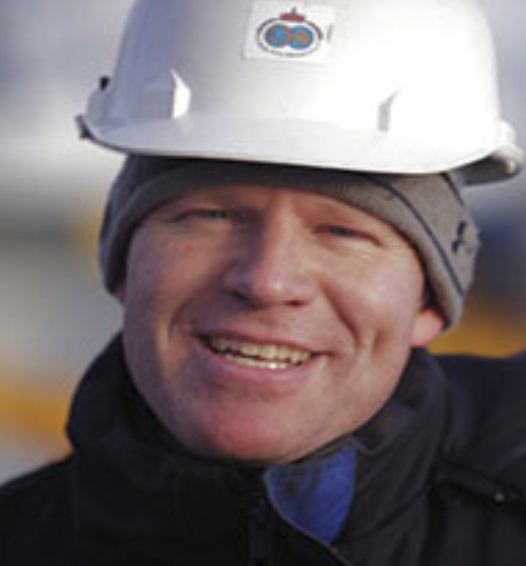
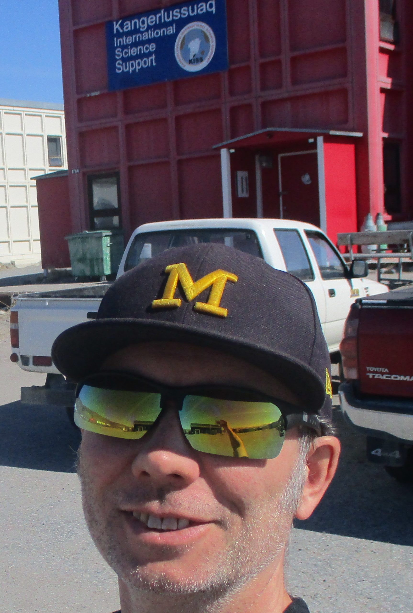
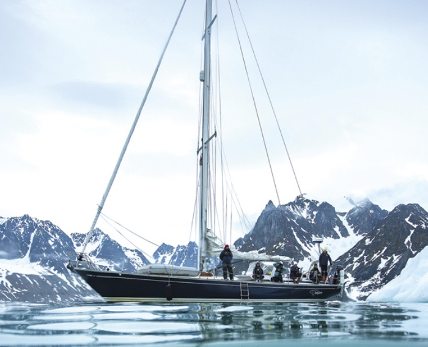
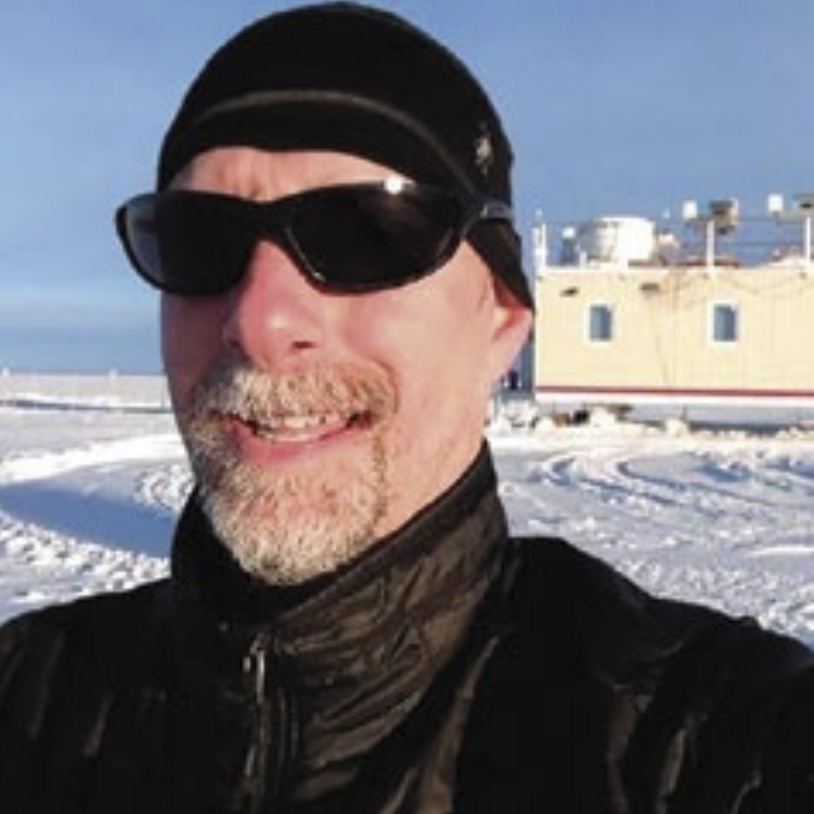

### Here is a bit about who we are and what we do.

:::: {.columns}
::: {.column width="60%"}
## Dr. Stephen (Steve) Hudson  
**Expedition Leader**  
Senior Researcher at the [Norwegian Polar Institute](https://www.npolar.no/)

Dr. Hudson leads the work package responsible for developing the Integrated Cloud Observatory with [TONe](https://www.npolar.no/en/tone/). His research focuses on how ice and snow interact with sunlight to affect Earth’s climate. Fascinated by polar regions since high school, Steve spent a winter at the South Pole in 2001 during graduate school. This experience sparked a passion for fieldwork, leading to multiple Arctic and Antarctic expeditions.
:::
::: {.column width="40%"}
{width=100%}
:::
::::

---

:::: {.columns}
::: {.column width="60%"}
## Marius Bratrein  
**Electrical Engineer**  
Instrumentation Engineer at the [Norwegian Polar Institute](https://www.npolar.no/)

Marius has a broad background in electrical engineering, instrumentation, logistics, and polar exploration. He has worked closely with Steve to prepare everything for the expedition to Troll, bringing invaluable technical expertise to the team.
:::
::: {.column width="40%"}
{width=100%}
:::
::::

---

:::: {.columns}
::: {.column width="60%"}
## Dr. Michael (Mike) Town  
**Climate Scientist**  
Vice President and Researcher at [Earth and Space Research](https://www.esr.org/)

Like Steve, Mike dreamed of adventurous fieldwork from an early age and fulfilled this dream in graduate school, wintering at the South Pole alongside Steve in 2001. His current research focuses on the surface energy budget over polar snow.
:::
::: {.column width="40%"}
{width=100%}
:::
::::

---

:::: {.columns}
::: {.column width="60%"}
## Even Birkeland  
**Engineer**  
Project Engineer at the [Norwegian Polar Institute](https://www.npolar.no/)

Even supports the [TONe](https://www.npolar.no/en/tone/) project and brings valuable local knowledge from his year at Troll. His technical and logistical expertise is a crucial asset to the expedition.
:::
::: {.column width="40%"}
{width=100%}
:::
::::

---

:::: {.columns}
::: {.column width="60%"}
## Dr. Ryan (Neely) R. Neely  
**Atmospheric Scientist**  
Associate Professor at the [University of Leeds](https://environment.leeds.ac.uk/see/staff/1447/dr-ryan-neely-iii) and [NCAS](https://ncas.ac.uk/)

Dr. Neely specializes in using remote sensing technologies, such as radar and lidar, to observe precipitation, clouds, and aerial fauna in innovative ways.
:::
::: {.column width="40%"}
{width=100%}
:::
::::

---

:::: {.columns}
::: {.column width="60%"}
## Prof. Von Walden  
**Atmospheric Scientist**  
Professor at [Washington State University](https://ce.wsu.edu/faculty/walden/)

Prof. Walden is a leading authority on meteorology, climatology, and global climate change. He conducts research in Antarctica, the Arctic, and the western USA, focusing on air pollution and water resources.
:::
::: {.column width="40%"}
{width=100%}
:::
::::

---

<!-- Here is a breakdown of our team:

Dr. Stephen (Steve) Hudson (Expedition Leader) is a Senior Researcher at the [Norwegian Polar Institute](https://www.npolar.no/) and leads work package responsible for devleoping the Integrated Cloud Observatory with [TONe](https://www.npolar.no/en/tone/). His research focuses mostly on the ways in which ice and snow interact with sunlight to affect Earth’s climate. He became fascinated by the polar regions before high school, and by university, he set his sights on spending a winter at the South Pole. In 2001, he lived this dream during graduate school, sparking a passion for fieldwork that’s taken him on multiple trips to both the Arctic and Antarctic.

{width=50%}

Marius Bratrein (Electrical Engineer) is an Instrumentation Engineer within the [Norwegian Polar Institute](https://www.npolar.no/). Marius has a broad background in electrical engineering, instrumentation, logisitics and polar exploration.  Marius has worked hand in hand with Steve to prepare everything for the expedition to Troll.

{width=50%}

Dr Michael (Mike) Town (Climate Scientist) is the Vice President of and Researcher at [Earth and Space Research] (https://www.esr.org/). Similar to Steve, Mike also dreamed of adventurous fieldwork from an early age and had these fullfilled in graduate school by wintering over at the South Pole alngside Steve in 2001. Mike current research focuses on the surface energy budget over polar snow. 

{width=50%}

Even Birkeland (Engineer) is a Project Engineer within Norwegian Polar Institute supporting the [TONe](https://www.npolar.no/en/tone/) project. Even has previously spent a year at Troll and brings valuable local knowledge along with technical and logisitical expertise support to the project. 

{width=50%}

Dr. Ryan (Neely) R. Neely (Atmospheric Scientist) is an Associate Professor at the [University of Leeds](https://environment.leeds.ac.uk/see/staff/1447/dr-ryan-neely-iii) and the UK's [National Centre for Atmospheric Science](https://ncas.ac.uk/). Neely focuses on using remote sensing technology (radar and lidar) to observe precipitation, clouds and aerial fauna in new ways. 

{width=50%}

Prof. Von Walden (Atmospheric Scientist) is a professor in the [Civil Engineering department at Washington State University](https://ce.wsu.edu/faculty/walden/). Walden is a leading authority on meteorology, climatology and global climatic change and conducts research in Antarctica and the Arctic as well as being a leader air pollution and water resources in the western USA.

{width=50%} -->
