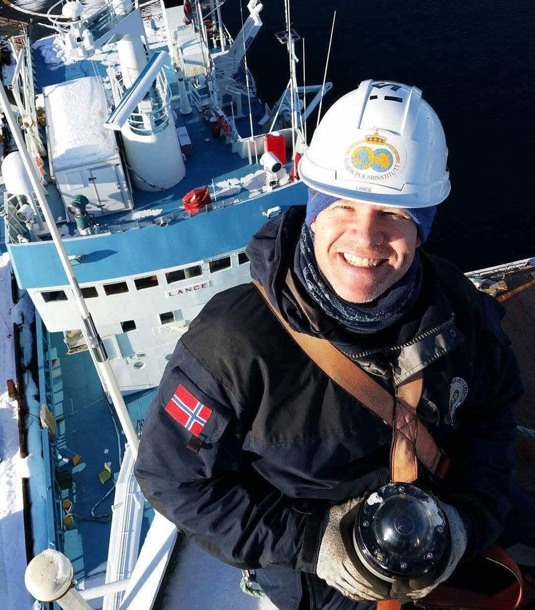

### Here is a bit about who we are and what we do.

:::: {.columns}
::: {.column width="60%"}
## Dr. Stephen (Steve) Hudson  
**Expedition Leader**  
Senior Researcher at the [Norwegian Polar Institute](https://www.npolar.no/)

Steve is a research scientist at the Norwegian Polar Institute, specializing in atmospheric science, light, and heat budgets in polar regions. He studied atmospheric science from his undergraduate degree at Cornell University through his PhD at the University of Washington, focusing on the heat budget and light interactions over Antarctica. Since moving to Norway in 2008, Steve has contributed to projects on Arctic sea ice, Svalbard glaciers, and weather and climate dynamics around Troll Station, Antarctica.

In the TONe project, Steve is leading the work package developing the Integrated Cloud Observatory. He brings expertise in the relationship between clouds and the accumulation or melt of snow in polar regions while collaborating closely with colleagues for broader expertise.

Outside of his work, Steve enjoys scuba diving and traveling, often combining the two in his adventures.

:::
::: {.column width="40%"}
{width=100%}
:::
::::

---

:::: {.columns}
::: {.column width="60%"}
## Marius Bratrein  
**Electrical Engineer**  
Instrumentation Engineer at the [Norwegian Polar Institute](https://www.npolar.no/)

Marius has a broad background in electrical engineering, instrumentation, logistics, and polar exploration. He has worked closely with Steve to prepare everything for the expedition to Troll, bringing invaluable technical expertise to the team.

:::
::: {.column width="40%"}
{width=100%}
photo credit: Tor-Ivan Karlsen/NPI
:::
::::

---

:::: {.columns}
::: {.column width="60%"}
## Dr. Michael (Mike) Town  
**Atmospheric Scientist and Glaciologist**  
Vice President and Research Scientist at [Earth and Space Research](https://www.esr.org/)

Mike currently studies the evolving interaction between the atmosphere and near-surface snow in polar regions.

Mike (and ESR) is very excited to be part of the TONe-ICO project. His roles in the field include, but are not limited to:
1. designing and implementing the surface science observations supporting the TONe-ICO project
2. putting wires through holes
3. moving things from here to there and back again

:::
::: {.column width="40%"}
{width=100%}
:::
::::

---

:::: {.columns}
::: {.column width="60%"}
## Even Birkeland  
**Engineer**  
Project Engineer at the [Norwegian Polar Institute](https://www.npolar.no/)

Even supports the [TONe](https://www.npolar.no/en/tone/) project and brings valuable local knowledge from his winterover at Troll and field experience as satellite engineer in Svalbard. His technical and logistical expertise is a crucial asset to the expedition.

:::
::: {.column width="40%"}
{width=100%}
:::
::::

---

:::: {.columns}
::: {.column width="60%"}
## Dr. Ryan (Neely) R. Neely III
**Atmospheric Scientist**  
Associate Professor at the [University of Leeds](https://environment.leeds.ac.uk/see/staff/1447/dr-ryan-neely-iii) and [NCAS](https://ncas.ac.uk/)

Neely specializes in using remote sensing technologies, such as radar and lidar, to observe precipitation, clouds, and aerial fauna in innovative ways.

Neely will be leading the installation of the remote sensing instrumentation on the ICO building. 

:::
::: {.column width="40%"}
{width=100%}
:::
::::

---

:::: {.columns}
::: {.column width="60%"}
## Prof. Von P. Walden  
**Atmospheric Scientist**  
Professor at [Washington State University](https://ce.wsu.edu/faculty/walden/)

Von is a leading authority on meteorology, climatology, and global climate change. He conducts research in Antarctica, the Arctic, and the western USA, focusing on air pollution and water resources.

Von will be providing critical technical and scientific support for the field team from the United States.

:::
::: {.column width="40%"}
{width=100%}
:::
::::

---

<!-- Here is a breakdown of our team:

Dr. Stephen (Steve) Hudson (Expedition Leader) is a Senior Researcher at the [Norwegian Polar Institute](https://www.npolar.no/) and leads work package responsible for devleoping the Integrated Cloud Observatory with [TONe](https://www.npolar.no/en/tone/). His research focuses mostly on the ways in which ice and snow interact with sunlight to affect Earth’s climate. He became fascinated by the polar regions before high school, and by university, he set his sights on spending a winter at the South Pole. In 2001, he lived this dream during graduate school, sparking a passion for fieldwork that’s taken him on multiple trips to both the Arctic and Antarctic.

{width=50%}

Marius Bratrein (Electrical Engineer) is an Instrumentation Engineer within the [Norwegian Polar Institute](https://www.npolar.no/). Marius has a broad background in electrical engineering, instrumentation, logisitics and polar exploration.  Marius has worked hand in hand with Steve to prepare everything for the expedition to Troll.

{width=50%}

Dr Michael (Mike) Town (Climate Scientist) is the Vice President of and Researcher at [Earth and Space Research] (https://www.esr.org/). Similar to Steve, Mike also dreamed of adventurous fieldwork from an early age and had these fullfilled in graduate school by wintering over at the South Pole alngside Steve in 2001. Mike current research focuses on the surface energy budget over polar snow. 

{width=50%}

Even Birkeland (Engineer) is a Project Engineer within Norwegian Polar Institute supporting the [TONe](https://www.npolar.no/en/tone/) project. Even has previously spent a year at Troll and brings valuable local knowledge along with technical and logisitical expertise support to the project. 

{width=50%}

Dr. Ryan (Neely) R. Neely (Atmospheric Scientist) is an Associate Professor at the [University of Leeds](https://environment.leeds.ac.uk/see/staff/1447/dr-ryan-neely-iii) and the UK's [National Centre for Atmospheric Science](https://ncas.ac.uk/). Neely focuses on using remote sensing technology (radar and lidar) to observe precipitation, clouds and aerial fauna in new ways. 

{width=50%}

Prof. Von Walden (Atmospheric Scientist) is a professor in the [Civil Engineering department at Washington State University](https://ce.wsu.edu/faculty/walden/). Walden is a leading authority on meteorology, climatology and global climatic change and conducts research in Antarctica and the Arctic as well as being a leader air pollution and water resources in the western USA.

{width=50%} -->
